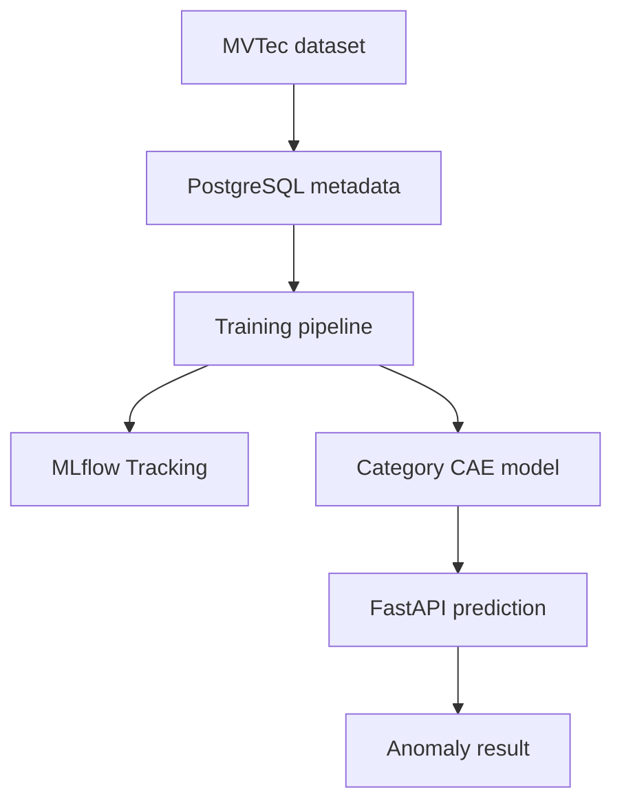

# Industrial Image Anomaly Detection — MLOps

This project implements an MLOps pipeline for detecting visual anomalies in
industrial images from the MVTec Anomaly Detection dataset.

A convolutional autoencoder reconstructs each input image. The difference
between the original image and its reconstruction is used to calculate an
anomaly score.

## Supported categories

The current project focuses on:

- Bottle
- Wood
- Pill

Each category has its own trained model and anomaly threshold.

## Project status

### Phase 1 — Foundations

- [x] Define the anomaly-detection objective
- [x] Load MVTec image metadata into PostgreSQL
- [x] Implement the convolutional autoencoder
- [x] Create category-specific training
- [x] Create prediction logic
- [x] Save models and thresholds
- [x] Implement FastAPI endpoints
- [x] Add model evaluation

### Phase 2 — Tracking and versioning

- [x] Add MLflow experiment tracking
- [x] Log training parameters
- [x] Log training and validation losses
- [x] Log holdout evaluation metrics
- [x] Log thresholds and evaluation reports
- [x] Log Keras models in MLflow
- [ ] Add MLflow Model Registry
- [ ] Compare candidate and champion models
- [ ] Add dataset versioning with DVC
- [ ] Split the application into Docker microservices
- [ ] Add scheduled training

## Architecture



## Project structure

```text
mlops_anomaly_detection/
├── api/
│   └── main.py
├── database/
│   ├── init.sql
│   └── load_data.py
├── src/
│   ├── training.py
│   ├── predict.py
│   └── evaluate.py
├── models/
│   ├── bottle/
│   ├── wood/
│   └── pill/
├── docker-compose.yml
├── requirements.txt
└── README.md
```

The dataset, trained models and local MLflow storage are excluded from Git.

## Installation

Clone the repository:

```bash
git clone git@github.com:mbrmpro/mlops_anomaly_detection.git
cd mlops_anomaly_detection
```

Create and activate a virtual environment:

```bash
python3 -m venv .venv
source .venv/bin/activate
```

Install the dependencies:

```bash
pip install -r requirements.txt
```

## Dataset

The expected dataset structure is:

```text
data/
├── bottle/
│   ├── train/
│   └── test/
├── wood/
│   ├── train/
│   └── test/
└── pill/
    ├── train/
    └── test/
```

Load the image metadata into PostgreSQL:

```bash
python database/load_data.py
```

## Model training

Train one category:

```bash
python src/training.py bottle --epochs 30
```

Train all project categories:

```bash
python src/training.py bottle wood pill --epochs 30
```

Run a smoke test without replacing the locally saved model:

```bash
python src/training.py bottle --epochs 1 --no-save
```

## MLflow experiment tracking

The training pipeline creates one MLflow run per category in the experiment:

```text
anomaly-detection-cae
```

Each run records:

- Category and model type
- Image size and batch size
- Learning rate and requested epochs
- Training, validation, calibration and holdout image counts
- Training and validation loss per epoch
- Calibration F1 score
- Holdout F1 and AUROC
- Accuracy, balanced accuracy, precision and recall
- Confusion-matrix values
- Selected anomaly threshold
- Evaluation and threshold JSON reports
- Trained Keras model and tensor signature

Start the MLflow interface:

```bash
mlflow ui \
  --backend-store-uri "sqlite:///$PWD/mlflow.db" \
  --host 127.0.0.1 \
  --port 5001
```

Open:

```text
http://127.0.0.1:5001
```

## Current bottle candidate

The latest tracked bottle candidate produced approximately:

| Metric | Value |
|---|---:|
| Holdout F1 | 0.8654 |
| Holdout AUROC | 0.6651 |

This model is still considered a candidate. It has not yet been promoted
through the MLflow Model Registry.

## API

Start the FastAPI application:

```bash
uvicorn api.main:app --host 127.0.0.1 --port 8000
```

Interactive documentation:

```text
http://127.0.0.1:8000/docs
```

Main endpoints:

| Method | Endpoint | Purpose |
|---|---|---|
| `POST` | `/training` | Train a category-specific model |
| `POST` | `/predict` | Predict whether an image is anomalous |
| `POST` | `/evaluate` | Evaluate a saved category model |

## Prediction example

```bash
curl -X POST http://127.0.0.1:8000/predict \
  -H "Content-Type: application/json" \
  -d '{
    "image_path": "data/bottle/test/good/018.png",
    "category": "bottle"
  }'
```

Example response:

```json
{
  "category": "bottle",
  "image_path": "data/bottle/test/good/018.png",
  "anomaly_score": 0.12,
  "threshold": 0.13,
  "prediction": "normal"
}
```

## Git and generated artifacts

The following local artifacts are not intended to be committed:

```text
data/
models/
mlflow.db
mlruns/
mlartifacts/
.venv/
```

Source code and configuration are versioned with Git. Models and experiment
results are tracked with MLflow.

## Next step

The next task is to register the trained models in the MLflow Model Registry,
compare new candidates with the current champion and promote only better models.

## Authors

- Ayoub
- Mohamed
